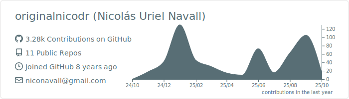
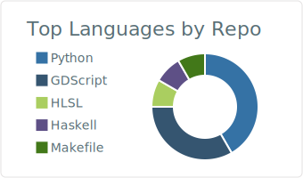
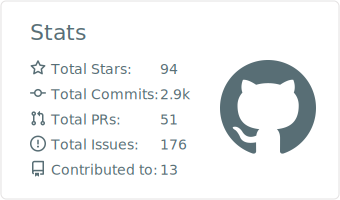

<!-- Banner made with 𝚃𝚢𝚙𝚎𝙸𝚝, 𝚅𝚞𝚎 𝙿𝚊𝚛𝚝𝚒𝚌𝚕𝚎𝙹𝚜 𝚊𝚗𝚍 𝚅𝚞𝚎: https://codesandbox.io/s/readme-intro-gif-forked-truvzj -->

   
  
   

NOTE: This does not indicate my skill level or language proficiency, it's merely a GitHub metric of which languages I have the most code of on GitHub.

# ✨ About me

Currently a computer science student working as a software engineer.

I like to work on interesting and challenging problems and reach simple and elegant solutions. I enjoy working on projects that I (and hopefully others) find helpful, especially if none has aimed to do something similar yet.

I enjoy working in environments that encourage learning, code quality, and personal growth.

My interests vary from modding, math, and machine learning to software engineering, game design, and the gaming industry as a whole.

Long live the open source!

## ⚡ Fun fact

I also like photography and virtual photography! If you want to see some of my work (only of the latter for now) head over to [my site](https://originalnicodr.github.io/virtual-photography/)!

In addition to that, I enjoy making games! Feel free to check out the projects I worked on in [here](https://itch.io/profile/originalnicodr). 

# 🛠️ Tools

### What I tend to use

  
  
  

### What I sometimes use (always learning 🌱)

  
  
  
  
  
  
  
  
  
  
  
  
  
  
  
  
  
  
  
  
  
  

### Other tools and knowledge

  
  
  
  
  
  

# 🚀 Projects

  
  
  
  
  
  

# ✒️ Latest blog posts

- [How we made a high quality image gallery without paying a single dime](https://originalnicodr.github.io/blog/how-we-made-a-high-quality-image-gallery-without-paying-a-single-dime)
- [How to create and host your own portfolio for free](https://originalnicodr.github.io/blog/how-to-create-and-host-your-own-portfolio-for-free)

--- 

| &nbsp;&nbsp;&nbsp; Website : <a href="https://originalnicodr.github.io">originalnicodr.github.io</a>
